# 집토리 데이터베이스 ERD

```mermaid
erDiagram
    apartments {
        text pnu PK "건물PNU"
        text bld_nm "건물명"
        int total_hhld_cnt "총세대수"
        int dong_count "동수"
        int max_floor "최고층"
        text use_apr_day "준공일"
        text plat_plc "지번주소"
        text new_plat_plc "도로명주소"
        text bjd_code "법정동코드"
        text sigungu_code "시군구코드"
        float lat "위도"
        float lng "경도"
        text bld_nm_norm "정규화명"
        text coord_source "좌표출처"
        text group_pnu "대표PNU"
    }

    apt_area_info {
        text pnu PK "건물PNU"
        float min_area "최소면적"
        float max_area "최대면적"
        float avg_area "평균면적"
        int unit_count "세대타입수"
        int area_types "면적타입수"
        int cnt_under_40 "40이하"
        int cnt_40_60 "40~60"
        int cnt_60_85 "60~85"
        int cnt_85_115 "85~115"
        int cnt_115_135 "115~135"
        int cnt_over_135 "135초과"
    }

    apt_kapt_info {
        text pnu PK "건물PNU"
        text kapt_code "K-APT코드"
        text sale_type "매매구분"
        text heat_type "난방방식"
        text builder "건설사"
        text developer "시공사"
        text apt_type "아파트유형"
        text mgr_type "관리방식"
        text structure "건축구조"
        int parking_cnt "주차대수"
        int cctv_cnt "CCTV대수"
        int elevator_cnt "엘리베이터수"
        int ev_charger_cnt "EV충전기수"
        timestamptz updated_at "갱신일"
    }

    apt_mgmt_cost {
        text pnu PK "건물PNU"
        text year_month PK "연월(YYYYMM)"
        bigint common_cost "공용관리비"
        bigint individual_cost "개별사용료"
        bigint repair_fund "장기수선충당금"
        bigint total_cost "합계"
        bigint cost_per_unit "세대당관리비"
        jsonb detail "상세항목"
    }

    apt_price_score {
        text pnu PK "건물PNU"
        float price_per_m2 "m2당가격"
        float sgg_avg_price_per_m2 "시군구평균"
        float price_score "가격점수"
        float jeonse_ratio "전세비율"
    }

    apt_safety_score {
        text pnu PK "건물PNU"
        float safety_score "종합안전점수"
        float crime_safety_score "범죄안전점수"
        float access_score "응급접근성(30)"
        float complex_score "단지내부보안(35)"
        float complex_cctv_score "CCTV점수(14)"
        float complex_security_score "경비비점수(11)"
        float complex_mgr_score "관리방식점수(5)"
        float complex_parking_score "주차율점수(5)"
        float regional_safety_score "지역안전(20)"
        float crime_adjust_score "범죄보정(15)"
        float data_reliability "신뢰도"
        int score_version "버전(3)"
        text complex_data_source "데이터출처"
    }

    apt_facility_summary {
        text pnu PK "건물PNU"
        text facility_subtype PK "시설유형"
        float nearest_distance_m "최근접거리"
        int count_1km "1km내개수"
        int count_3km "3km내개수"
        int count_5km "5km내개수"
    }

    apt_vectors {
        text pnu PK "건물PNU"
        array vector "유사도벡터"
        text feature_names "피처명"
        timestamptz updated_at "갱신일"
    }

    school_zones {
        text pnu PK "건물PNU"
        text elementary_school_name "초등학교명"
        text elementary_school_id "초등학교코드"
        text middle_school_zone "중학교학군"
        text high_school_zone "고등학교학군"
        text high_school_zone_type "고교유형"
        text edu_office_name "교육청"
        text edu_district "교육지원청"
    }

    facilities {
        text facility_id PK "시설ID"
        text facility_type "시설대분류"
        text facility_subtype "시설소분류"
        text name "시설명"
        float lat "위도"
        float lng "경도"
        text address "주소"
        boolean is_active "활성여부"
        timestamptz updated_at "갱신일"
    }

    trade_history {
        int id PK "ID(SERIAL)"
        text apt_seq "아파트시퀀스"
        text sgg_cd "시군구코드"
        text apt_nm "아파트명"
        int deal_amount "거래금액(만원)"
        float exclu_use_ar "전용면적"
        int floor "층"
        int deal_year "거래년"
        int deal_month "거래월"
        int deal_day "거래일"
        int build_year "건축년도"
        timestamptz created_at "적재일"
    }

    rent_history {
        int id PK "ID(SERIAL)"
        text apt_seq "아파트시퀀스"
        text sgg_cd "시군구코드"
        text apt_nm "아파트명"
        int deposit "보증금(만원)"
        int monthly_rent "월세(만원)"
        float exclu_use_ar "전용면적"
        int floor "층"
        int deal_year "거래년"
        int deal_month "거래월"
        int deal_day "거래일"
        timestamptz created_at "적재일"
    }

    trade_apt_mapping {
        text apt_seq PK "아파트시퀀스"
        text pnu "건물PNU"
        text apt_nm "아파트명"
        text sgg_cd "시군구코드"
        text match_method "매칭방법"
    }

    common_code {
        text group_id PK "그룹ID"
        text code PK "코드"
        text name "코드명"
        text extra "부가정보"
        int sort_order "정렬순서"
    }

    population_by_district {
        text sigungu_code PK "시군구코드"
        text age_group PK "연령대"
        text sido_name "시도명"
        text sigungu_name "시군구명"
        int total_pop "총인구"
        int male_pop "남성인구"
        int female_pop "여성인구"
    }

    sigungu_crime_detail {
        text sigungu_code PK "시군구코드"
        int murder "살인"
        int robbery "강도"
        int sexual_assault "성범죄"
        int theft "절도"
        int violence "폭력"
        int total_crime "합계"
        int resident_pop "주민등록인구"
        float crime_rate "범죄율"
        float crime_safety_score "안전점수"
    }

    sigungu_crime_score {
        text sigungu_code PK "시군구코드"
        float crime_safety_score "범죄안전점수"
        int updated_year "기준연도"
    }

    sigungu_safety_index {
        text sigungu_code PK "시군구코드"
        text sido_name "시도명"
        text sigungu_name "시군구명"
        int traffic_grade "교통사고등급"
        int fire_grade "화재등급"
        int crime_grade "범죄등급"
        int living_safety_grade "생활안전등급"
        float composite_score "종합점수"
    }

    traffic_accident_hotspot {
        int id PK "ID(SERIAL)"
        text sigungu_name "시군구명"
        text spot_name "지점명"
        int accident_cnt "사고건수"
        int death_cnt "사망자"
        float lat "위도"
        float lng "경도"
    }

    chat_feedback {
        int id PK "ID(SERIAL)"
        text user_message "사용자메시지"
        text assistant_message "응답메시지"
        int rating "평점"
        array tags "태그"
        timestamptz created_at "생성일"
    }

    %% 관계
    apartments ||--o| apt_area_info : "pnu"
    apartments ||--o| apt_kapt_info : "pnu"
    apartments ||--o{ apt_mgmt_cost : "pnu"
    apartments ||--o| apt_price_score : "pnu"
    apartments ||--o| apt_safety_score : "pnu"
    apartments ||--o{ apt_facility_summary : "pnu"
    apartments ||--o| apt_vectors : "pnu"
    apartments ||--o| school_zones : "pnu"
    apartments }o--|| common_code : "sigungu_code"
    trade_apt_mapping }o--|| apartments : "pnu"
    trade_history }o--|| trade_apt_mapping : "apt_seq"
    rent_history }o--|| trade_apt_mapping : "apt_seq"
    apt_facility_summary }o--|| facilities : "facility_subtype"
    sigungu_crime_detail ||--o| sigungu_crime_score : "sigungu_code"
    sigungu_safety_index }o--|| population_by_district : "sigungu_code"
```

## 테이블 요약 (19개)

| 그룹 | 테이블 | 건수 | 설명 |
|------|--------|------|------|
| **아파트 마스터** | apartments | 26,437 | 건물 기본정보 (PNU, 좌표, 세대수) |
| **아파트 부가** | apt_area_info | 17,562 | 면적 정보 |
| | apt_kapt_info | 6,002 | K-APT 단지정보 (CCTV, 경비, 관리) |
| | apt_mgmt_cost | 80,089 | 월별 관리비 상세 |
| | apt_price_score | 21,507 | 가격 점수/전세비율 |
| | apt_safety_score | 23,748 | 안전점수 v3 (4영역) |
| | apt_facility_summary | 403,716 | 시설별 거리/개수 집계 |
| | apt_vectors | 22,805 | 유사도 벡터 |
| | school_zones | 9,610 | 학군 정보 |
| **시설** | facilities | 208,633 | 통합 시설 마스터 (17종) |
| **거래** | trade_history | 2,611,674 | 매매 이력 |
| | rent_history | 5,706,069 | 전월세 이력 |
| | trade_apt_mapping | 28,936 | 거래↔아파트 매핑 |
| **지역 통계** | sigungu_crime_detail | 134 | 시군구별 범죄통계 |
| | sigungu_crime_score | 77 | 범죄 안전점수 |
| | sigungu_safety_index | 133 | 행안부 지역안전지수 |
| | population_by_district | 2,068 | 인구통계 |
| | traffic_accident_hotspot | 5,294 | 교통사고 다발지역 |
| **공통** | common_code | 5,447 | 통합 코드 테이블 |
| **사용자** | chat_feedback | 0 | 챗봇 피드백 |
